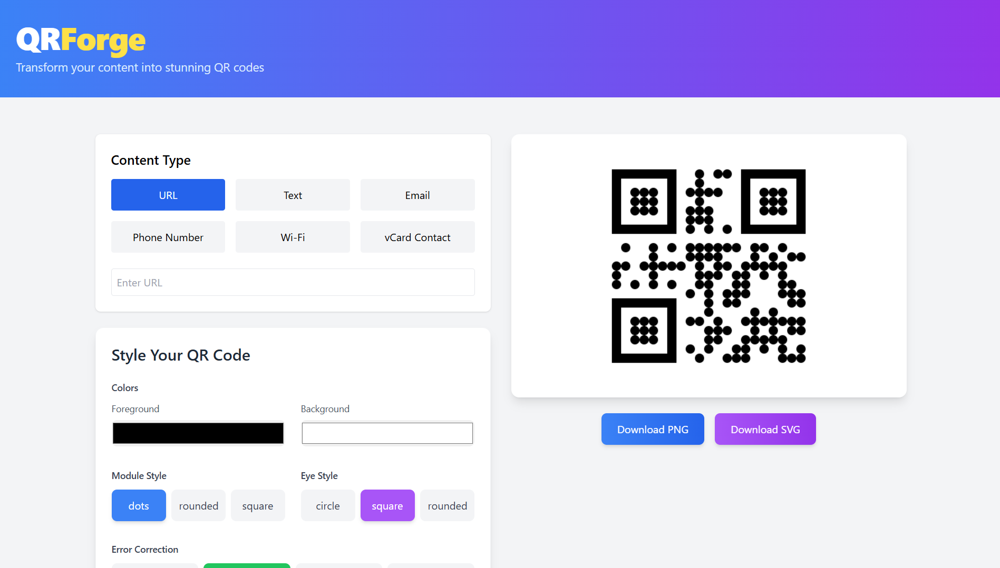

# QRForge - Advanced QR Code Generator

QRForge is a modern, feature-rich QR code generator built with React and Vite. Create customized QR codes with real-time preview, multiple styling options, and logo embedding capabilities.



## ✨ Features

### 🎯 Multiple Content Types
- URL links
- Plain text
- Email addresses
- Phone numbers
- Wi-Fi credentials
- vCard/Contact information

### 🎨 Customization Options
- Custom foreground and background colors
- Multiple module styles (dots, rounded, square)
- Eye style customization (circle, square, rounded)
- Error correction level selection
- Gradient fill support

### 🖼️ Logo Integration
- Upload and embed custom logos
- Auto-resize and center positioning
- Preview before generating
- Supports PNG, JPG, and SVG formats

### 💾 Export Options
- Download as PNG
- Download as SVG
- High-quality output
- Transparent background support

## 🚀 Getting Started

### Prerequisites
- Node.js (v14 or higher)
- npm or yarn

### Installation

1. Clone the repository:
```bash
git clone https://github.com/yourusername/qrforge.git
```
2. Install dependencies:
```bash
npm install
 ```

3. Start the development server:
```bash
npm run dev
 ```

4. Build for production:
```bash
npm run build
 ```

## 🛠️ Built With
- React.js
- Vite
- Tailwind CSS
- qr-code-styling
- html-to-image
## 📝 Usage
1. Select the content type for your QR code
2. Enter the required information
3. Customize the appearance using the style options
4. Upload a logo (optional)
5. Preview your QR code in real-time
6. Download in your preferred format
## 🤝 Contributing
Contributions are welcome! Please feel free to submit a Pull Request.

## 📄 License
This project is licensed under the MIT License - see the LICENSE file for details.

## 🙏 Acknowledgments
- qr-code-styling library
- Tailwind CSS team
- React.js community
## 📧 Contact
Your Name - your.email@example.com

Project Link: https://github.com/yourusername/qrforge